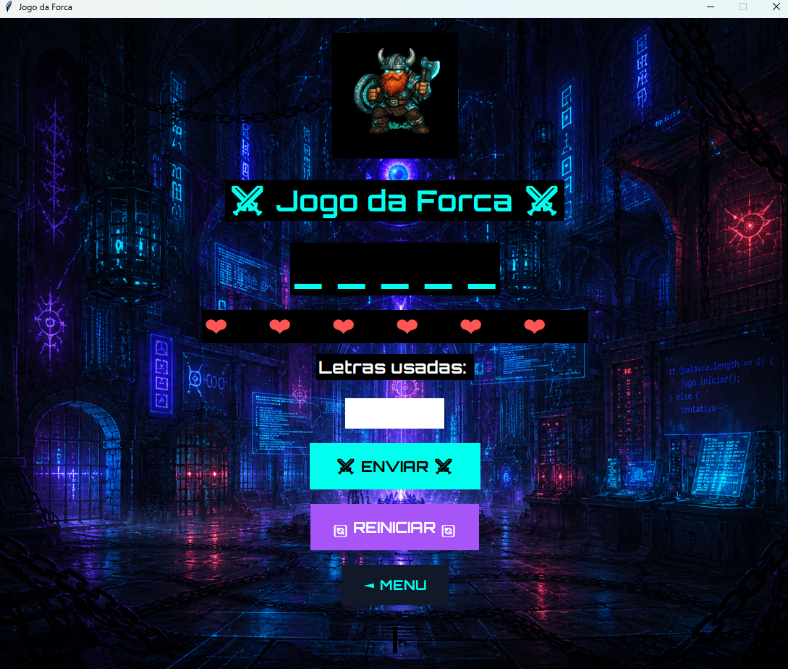
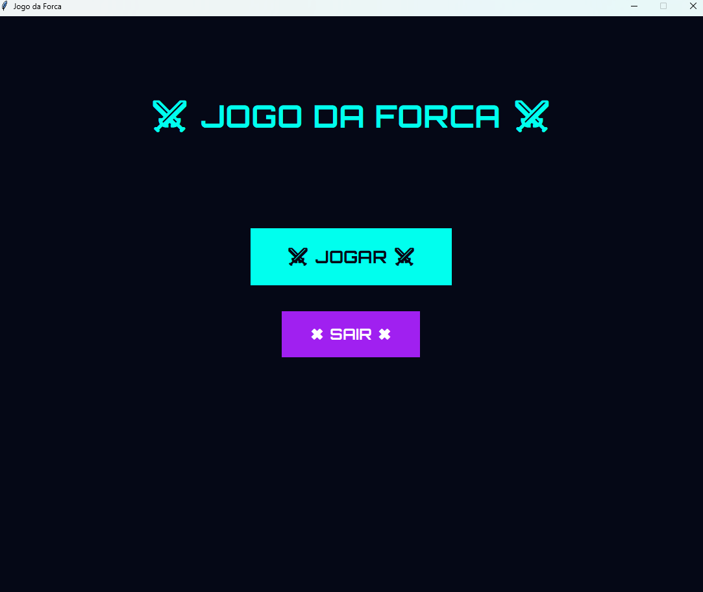
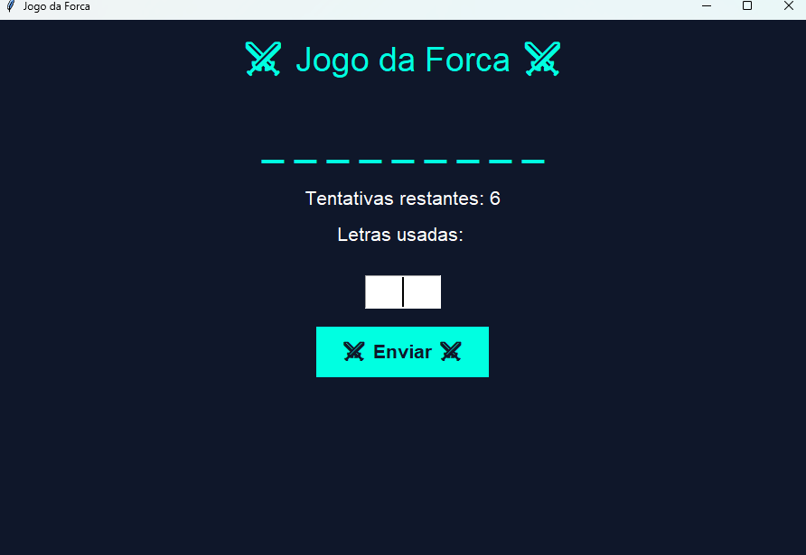

<div align="center">

# ⚔ CYBER HANGMAN

*Um jogo da forca com alma medieval e estética cyberpunk.*


</div>

---

## Sobre o Projeto

**Cyber Hangman** é um jogo da forca desenvolvido em Python com identidade visual inspirada em *Hyper Light Drifter*, *Ragnarok Online* e *Octopath Traveler* — fundindo estética pixel art, fantasia medieval e cyberpunk em uma experiência coesa e imersiva.

O projeto nasceu como atividade acadêmica no curso de ADS da Cruzeiro do Sul, mas evoluiu para uma produção indie com atenção a UI, assets, arquitetura de código e distribuição via executável standalone.

---

## Screenshots

<div align="center">

| Menu | Gameplay |
|:---:|:---:|
|  |  |

| Tela sem background | Sprite em ação |
|:---:|:---:|
|  |  |

</div>

---

## Funcionalidades

### Implementadas

- Menu inicial com navegação entre telas
- Tela de gameplay separada e estilizada
- Sprites dinâmicos do guerreiro anão com 7 estados visuais (idle → derrota)
- Sistema de tentativas com feedback visual em tempo real
- Trilha sonora com reprodução automática via VLC
- Backgrounds customizados para menu e gameplay
- Validação de entrada com mensagens de erro temáticas
- Reinício de partida sem fechar a aplicação
- Botão de retorno ao menu principal
- Interface medieval cyberpunk com paleta `#00ffee` / `#a855f7`
- Distribuição como executável `.exe` via PyInstaller

### Planejadas

- Sistema de ranking local com save
- Níveis de dificuldade
- Categorias de palavras temáticas
- Efeitos visuais de glow e VFX
- Tela de configurações (volume, idioma)
- Sistema de achievements
- Modo multiplayer cooperativo

---

## Tecnologias

| Tecnologia | Uso |
|---|---|
| **Python 3.12** | Linguagem principal |
| **Tkinter** | Interface gráfica e gerenciamento de telas |
| **Pillow** | Carregamento, redimensionamento e renderização de imagens |
| **python-vlc** | Reprodução de música e efeitos sonoros |
| **PyInstaller** | Empacotamento em executável standalone `.exe` |

---

## Estrutura do Projeto

```
cyber_hangman/
│
├── assets/
│   ├── backgrounds/
│   │   ├── background_game.png
│   │   └── background_menu.png
│   │
│   ├── icon/
│   │   └── dwarf_victory.ico
│   │
│   ├── sounds/
│   │
│   └── sprites/
│       ├── dwarf_idle.png
│       ├── dwarf_hang_0.png
│       ├── dwarf_hang_1.png
│       ├── dwarf_hang_2.png
│       ├── dwarf_hang_3.png
│       ├── dwarf_hang_4.png
│       ├── dwarf_defeat.png
│       ├── dwarf_gameover.png
│       └── dwarf_victory.png
│
├── screenshots/
│   ├── alpha1.png
│   ├── alpha_hang.png
│   ├── background_menu_print.png
│   ├── background_game_print.png
│   └── menu_no_background.png
│
├── forca.py
├── interface.py
└── .gitignore
```

---

## Instalação

### Pré-requisitos

- Python 3.10 ou superior
- VLC Media Player instalado na máquina
- pip atualizado

### Clonar e rodar

```bash
git clone https://github.com/kskios/forca-python.git
cd forca-python
```

```bash
pip install pillow python-vlc pyinstaller
```

```bash
python interface.py
```

---

## Gerar Executável

Para distribuir o jogo sem necessidade de Python instalado:

```bash
pyinstaller --noconfirm --onefile --windowed --add-data "assets;assets" --icon "assets/icon/dwarf_victory.ico" interface.py
```

O executável será gerado em `dist/interface.exe`.

> **Nota:** A função `resource_path()` no código garante que os assets sejam localizados corretamente tanto no ambiente de desenvolvimento quanto dentro do `.exe`.

---

## Identidade Visual

A estética do projeto é inspirada em:

- **Hyper Light Drifter** — paleta fria, atmosfera densa e minimalismo narrativo
- **Ragnarok Online** — sprites de anão medievais e fantasia pixel art
- **Octopath Traveler** — contraste entre ambientes escuros e personagens iluminados

Paleta principal: `#00ffee` · `#a855f7` · `#ff5555` · `#111827`

---

## Autor

Desenvolvido por **Giovanni** · **@kskios**

[](https://github.com/kskios)
[](https://www.linkedin.com/in/giovannibf/)

---

<div align="center">
<sub>Projeto iniciado como atividade acadêmica · ADS — Cruzeiro do Sul · Alpha em desenvolvimento ativo</sub>
</div>

---
---

<div align="center">

# ⚔ CYBER HANGMAN — EN

*A hangman game with a medieval soul and cyberpunk aesthetic.*


</div>

---

## About

**Cyber Hangman** is a hangman game built in Python with a visual identity inspired by *Hyper Light Drifter*, *Ragnarok Online*, and *Octopath Traveler* — blending pixel art, medieval fantasy, and cyberpunk into a cohesive and immersive experience.

The project started as an academic assignment at Cruzeiro do Sul University (ADS program) and evolved into an indie production with focus on UI design, asset pipeline, code architecture, and standalone executable distribution.

---

## Screenshots

<div align="center">

| Menu | Gameplay |
|:---:|:---:|
|  |  |

| No background | Sprite in action |
|:---:|:---:|
|  |  |

</div>

---

## Features

### Implemented

- Main menu with screen transitions
- Separate styled gameplay screen
- Dynamic dwarf warrior sprites with 7 visual states (idle → defeat)
- Attempt system with real-time visual feedback
- Auto-playing soundtrack via VLC
- Custom backgrounds for menu and gameplay
- Input validation with themed error messages
- In-game restart without closing the app
- Return to main menu button
- Medieval cyberpunk UI with `#00ffee` / `#a855f7` palette
- Standalone `.exe` distribution via PyInstaller

### Planned

- Local ranking system with save
- Difficulty levels
- Themed word categories
- Glow and VFX visual effects
- Settings screen (volume, language)
- Achievement system
- Cooperative multiplayer mode

---

## Technologies

| Technology | Usage |
|---|---|
| **Python 3.12** | Core language |
| **Tkinter** | GUI and screen management |
| **Pillow** | Image loading, resizing and rendering |
| **python-vlc** | Music and sound effect playback |
| **PyInstaller** | Packaging into standalone `.exe` |

---

## Installation

### Requirements

- Python 3.10 or higher
- VLC Media Player installed
- Updated pip

### Clone and run

```bash
git clone https://github.com/kskios/forca-python.git
cd forca-python
```

```bash
pip install pillow python-vlc pyinstaller
```

```bash
python interface.py
```

---

## Build Executable

To distribute the game without requiring Python:

```bash
pyinstaller --noconfirm --onefile --windowed --add-data "assets;assets" --icon "assets/icon/dwarf_victory.ico" interface.py
```

The executable will be generated at `dist/interface.exe`.

> **Note:** The `resource_path()` function in the code ensures assets are correctly located both in the dev environment and inside the `.exe`.

---

## Visual Identity

The project's aesthetic is inspired by:

- **Hyper Light Drifter** — cold palette, dense atmosphere and narrative minimalism
- **Ragnarok Online** — medieval dwarf sprites and pixel art fantasy
- **Octopath Traveler** — contrast between dark environments and lit characters

Core palette: `#00ffee` · `#a855f7` · `#ff5555` · `#111827`

---

## Author

Developed by **Giovanni** · **@kskios**

[](https://github.com/kskios)
[](https://www.linkedin.com/in/giovannibf/?locale=en-US)

---

<div align="center">
<sub>Started as an academic assignment · ADS — Cruzeiro do Sul University · Alpha under active development</sub>
</div>